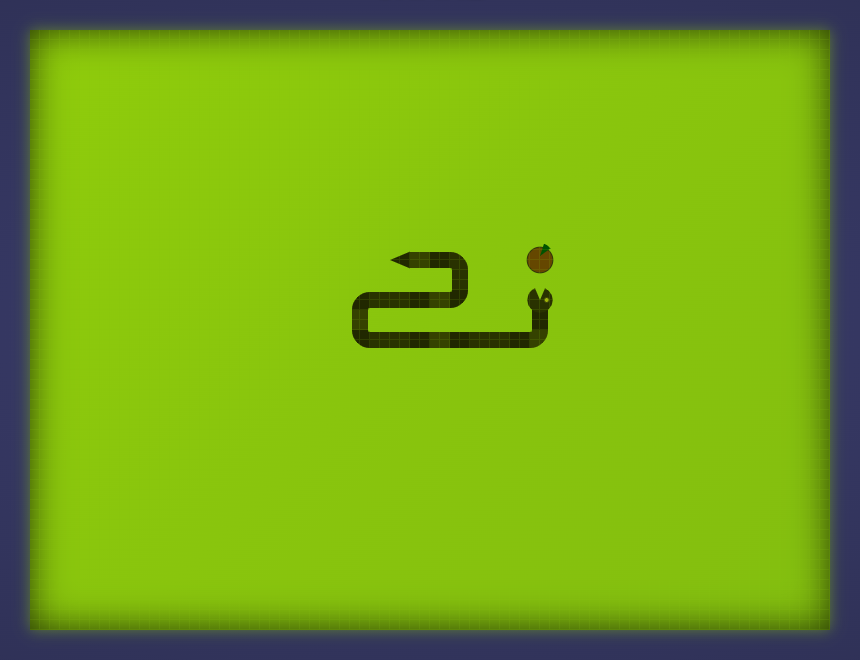
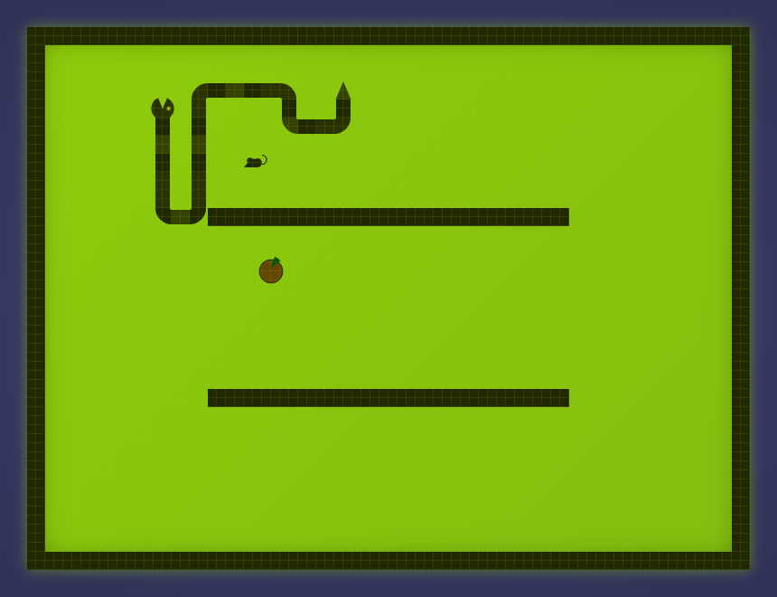

# SNAKE

It's snake! ... you know it, eat and slide. Don't die tho!

[Play online](https://derDere.github.io/snake)

## Screenshots

## More Info

It was made as a learning project. Code is not the best but it works and its fun.

There are some options to change the game up a bit and there is a local high score system.

## Features
 - A snake (Jup its also a feature! Imagine the game without it.)
 - some fruits (There are vegan snakes to ok!)
 - mice problem (They keep running away! Traps not included.)
 - walls (or a tube maybe?)
 - Frame (What's in the box?!)
 - super high resolution nokia display
 - now mobile ready
 - real single page app

## Options

### Walls
Create two walls in the middle of the field. Don't bump your head.

### Frame
Create an outer frame around the field. Some people have pet snakes! But keep them in their cage!

### Lifes
Ever seen an invincible ghost snake that can pass throu walls and their own body? Me neighter, but I think they eat mice.

## Score Board
I didn't want to deal with hacking or AI snakes (thanks code bullet) so I just store the scores in your localStorage.
That way no one can F***up some online competition. Each option combination has it's own score board tho.
I also only save the best 20 entries becaus it looks good.

## Single Page App
This game is literaliy just one single html file. So feel free to save it and play it offline.
